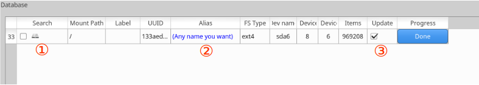
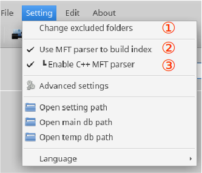

# DawnlightSearch
A Linux version of [Everything Search Engine](https://www.voidtools.com/). Show instant results as you type.

Framework: 

 - Core: Python3
 - Gui: PyQt5
 - Database: SQLite3

Test environment:

 - Xubuntu 16.04 

Highlights:

 - Quick file indexing for NTFS partition by parsing master file table (MFT).
 - Support wildcards and regular expressions.
 - Support filter on multi fileds: file name, folder, full path, size, mtime, ctime, and atime. 

Video demo: [https://youtu.be/949Jm9j4sP4](https://youtu.be/949Jm9j4sP4)

### Interface:

#### Database:

Partitions of differenct UUIDs will be stored seperatedly in the database. In circumstances where duplicate UUIDs exist, they will be treated as a single one and records will be overwritten. 

1. Whether search this partition. **You need to check it to search the corresponding partition.** Icon indicates the mount state.

2. Can be changed into any name you want. Will display in front of the path when partition unmounted.

3. Whether update this partition when “*Update DB*” clicked. You can always update a partition using the context menu, regardless of the checked state.

#### Menubar:

1. Edit excluded paths when indexing. Only full path is supported right now. Note: MFT parser will disregard this option.

2. Check this option to use MFT parser to speed up building index on an NTFS partition (like other MFT based searcher). 

3. Check to use the C++ MFT parser instead of the Python one. The C++ one is supposed to be much faster.

#### Search Syntax:

  Logical Operators   |  Description 
-------- | ---
&#160;  *space* | AND
 &#124; *vertical bar*   | OR
!   *exclamation mark* | NOT

  Wildcards   |  Description 
-------- | ---
&#160;  *space* | AND
 &#124; *vertical bar*   | OR
!   *exclamation mark* | NOT

### Installation:

* Ubuntu 16.04:
> ppa: [https://launchpad.net/~chg-hou/+archive/ubuntu/dawnlightsearch](https://launchpad.net/~chg-hou/+archive/ubuntu/dawnlightsearch)

> $ sudo add-apt-repository ppa:chg-hou/dawnlightsearch

> $ sudo apt-get update

> $ sudo apt-get install python3-dawnlightsearch 

* others:

> $ cd src
 
> $ python3 setup.py install
 
### TODO:
 - Auto indexing.
 - Monitor file system changes.
 - Index files in archives.
 - More language options
 - Support Windows.

## Similar Projects:

 - [ANGRYsearch](https://github.com/DoTheEvo/ANGRYsearch) (python)
 - [FSearch](https://github.com/cboxdoerfer/fsearch)

